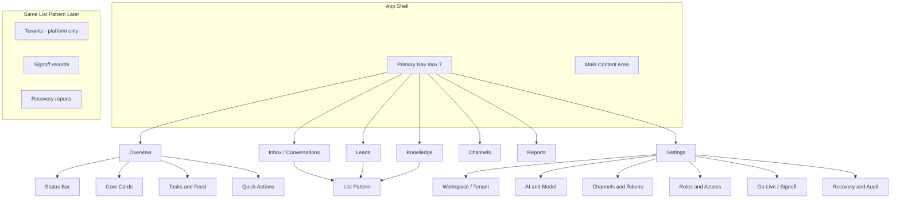

# ChatFlow Pro — 商业 SaaS 后台 UI 重构蓝图

**性质**：**设计真源**（页面结构 + 导航 + 骨架 wireframe + 视觉草案）；**不是**实现任务单、**不是**品牌定稿。  
**范围**：租户侧 **商业控制台**（可与 `public/tenant-app.html` 演进对齐）；平台级 `platform-admin.html` **另页**保持「Platform」心智，**不**混入本导航。  
**版本锚点**：与当前仓库共存；**不**绑定 Phase D-C / E。  
**日期**：2026-04-09  

---

## 1. 信息架构图（IA）

**原则**：主区 = **业务动作**；**Settings** = 系统/合规/深度配置；工程实现细节（token 字段名、JSON 原文）**下沉**到 Settings 子组或高级面板。



**导航数量**：主导航 **7** 项（未超 8）。  
**业务 vs 设置**：客户默认在 Overview → Inbox / Leads / Knowledge / Channels / Reports 完成日课；**Settings** 单独入口，侧边为 **Setup** vs **Advanced** 两层（见 §5）。

---

## 2. 主导航方案（定稿候选）

| # | 路由段（建议） | 标签（UI） | 心智 | 备注 |
|---|----------------|------------|------|------|
| 1 | `/app` 或 `/app/overview` | **Overview** | 今天该不该做事、系统是否就绪 | **默认落地页** |
| 2 | `/app/inbox` | **Inbox** / *Conversations* | 一线运营主工作台 | 副标题可选英文 |
| 3 | `/app/leads` | **Leads** | 线索与跟进 | |
| 4 | `/app/knowledge` | **Knowledge** | FAQ / 知识库 | 列表 + 编辑器进二级 |
| 5 | `/app/channels` | **Channels** | 渠道连接与健康 | **不**在主导航展开 7 个渠道 logo |
| 6 | `/app/reports` | **Reports** | 报表与导出（后期可简化为「Insights」） | 首版可占位 + 关键 KPI |
| 7 | `/app/settings` | **Settings** | 工作区、AI、凭证、权限、签核、审计 | **唯一**主入口放 token/secret 类配置 |

**刻意不放主导航**：`Team`（并入 **Settings → Roles & Access** 或 Overview 快捷入口）、`AI` 独立顶栏（并入 **Settings → AI & Model** + Overview 卡片状态）、原始 **JSON  textarea 编辑**（仅 Advanced）、**Platform** 级菜单（仅 `platform-admin`）。

**Settings 内部分组（侧边二级）**：

| 组 | 内容概要 | 默认可见性 |
|----|----------|------------|
| **Workspace / Tenant** | 名称、slug、时区、品牌占位 | Setup + Advanced |
| **AI & Model** | 开关、模型、用量提示（密钥入口折叠） | Setup（简化） / Advanced（完整） |
| **Channels & Tokens** | 渠道卡片式连接向导；密钥在「连接」流内 | Setup 引导；**不**首屏堆字段 |
| **Roles & Access** | 成员、角色、邀请 | Advanced 为主 |
| **Go-Live / Signoff** | 检查清单状态、链向 Phase E 模板/报告（只读链接） | Setup 末步 + Advanced |
| **Recovery & Audit** | 只读报告入口、审计日志（若 API 有） | **仅 Advanced** |

---

## 3. 首页（Overview）Wireframe

**定位**：**行动首页**（Action Home），**不是**数据展板。图表 **延后**。

### 3.1 页面栅格（ASCII）

```
┌──────────────────────────────────────────────────────────────────────────┐
│ [Logo] ChatFlow                                    [Search ⌘K] [User ▾]   │
├─────────────┬────────────────────────────────────────────────────────────┤
│ Overview    │  A. TOP STATUS BAR (full width, 1 row, 3 zones)            │
│ Inbox       │  ┌─────────────┬─────────────┬─────────────────────────┐   │
│ Leads       │  │ Setup: ●●○○  │ Channels: 5/7│ Go-live: Not signed     │   │
│ Knowledge   │  │ Ready 60%   │ 2 alerts    │ [Open signoff checklist]│   │
│ Channels    │  └─────────────┴─────────────┴─────────────────────────┘   │
│ Reports     │                                                            │
│ ─────────   │  B. CORE CARDS (2×2 or 4 cols, equal height)                 │
│ Settings    │  ┌──────────┐ ┌──────────┐ ┌──────────┐ ┌──────────┐       │
│             │  │ New conv │ │ New leads│ │ Handoff  │ │ Channel  │       │
│             │  │   12     │ │    3     │ │ pending 5│ │ health   │       │
│             │  │ [Open]   │ │ [Open]   │ │ [Open]   │ │ [Fix]    │       │
│             │  └──────────┘ └──────────┘ └──────────┘ └──────────┘       │
│             │                                                            │
│             │  C. TWO COLUMN (60/40)                                       │
│             │  ┌────────────────────────────┐ ┌─────────────────────┐   │
│             │  │ C1 To-do (ordered list)    │ │ C2 Recent activity  │   │
│             │  │ • Connect LINE             │ │ 10:02 Lead captured │   │
│             │  │ • Add 3 FAQ                │ │ 09:41 Handoff       │   │
│             │  │ • Invite teammate          │ │ ...                 │   │
│             │  └────────────────────────────┘ └─────────────────────┘   │
│             │                                                            │
│             │  D. QUICK ACTIONS (horizontal chips / buttons)             │
│             │  [Configure channel] [Add FAQ] [View leads] [Go-live docs]  │
└─────────────┴────────────────────────────────────────────────────────────┘
```

### 3.2 区块职责（必须遵守）

| 块 | 回答的问题 | 数据上限 |
|----|------------|----------|
| **A 状态条** | 配置完成度、渠道是否有告警、签核是否未完成 | 每区 **1 主指标 + 1 次指标 + 1 CTA** |
| **B 核心卡** | 今天新会话 / leads / handoff / 渠道健康 | **无**图表；仅数字 + 状态色 + 主按钮 |
| **C 待处理** | 下一步最该做什么 | **≤5** 条可执行 todo（可来自 setup progress API） |
| **D 快捷操作** | 一键去常用任务 | **4** 个固定坑位，多出的收进「更多」 |

---

## 4. 列表页通用 Wireframe（List Pattern）

**适用**：Conversations、Leads、Knowledge/FAQ、（平台）Tenants、Signoff records、Recovery reports — **同一壳**。

### 4.1 通用结构（ASCII）

```
┌──────────────────────────────────────────────────────────────────────────┐
│ H1 Title                          [Primary action] [Secondary]            │
│ 一句话说明当前列表语境                                                    │
├──────────────────────────────────────────────────────────────────────────┤
│ [Search……………………………] [Filter ▾] [Sort ▾] [Columns ▾] [Batch ▾]            │
├──────────────────────────────────────────────────────────────────────────┤
│ □  Col1      Col2        Status      Updated      ⋮                       │
│ □  row…      …           [Tag]       2h ago       [open]                   │
│ □  …                                                                     │
│   (row click → detail route OR slide-over panel; preserve list context)   │
├──────────────────────────────────────────────────────────────────────────┤
│ Showing 1–25 of 240        [◀] [1][2][3] [▶]                               │
└──────────────────────────────────────────────────────────────────────────┘

States (same slot):
- Loading: skeleton rows ×8
- Empty: illustration + 1 sentence + 1 primary CTA
- Error: inline banner + retry
- Success toast: after batch action (non-blocking)
```

### 4.2 统一能力清单（验收用）

| 能力 | 规则 |
|------|------|
| **搜索** | 顶栏单一搜索框；具体搜字段按实体定义（会话 id / 用户 / 关键词） |
| **筛选** | Filter 面板：保存「视图」可二期；首版 **3–5** 个高频筛选项 |
| **排序** | Sort：显式列排序 + 默认排序文档化 |
| **状态标签** | 语义色固定映射（见 §6） |
| **批量操作** | 选中后激活 Batch 菜单；危险操作二次确认 |
| **列显隐** | Columns 下拉；偏好存 localStorage 或用户设置 API |
| **行交互** | 整行可点；`⋮` 放次要操作 |
| **详情** | **侧栏优先**（宽屏）；窄屏全屏详情 |
| **Empty / Loading / Error** | **同一布局槽位**，不换页结构 |

---

## 5. Settings / Onboarding — 两层结构

### 5.1 Layer A — Setup flow（首次与「未完成」时强调）

**形态**：步骤条（Stepper）+ 每步 **单屏主任务**（不要一页长表单）。

| Step | 用户目标 | UI |
|------|----------|-----|
| 1 | 有工作区 | Create / confirm tenant |
| 2 | AI 可用 | Connect AI key（折叠高级模型） |
| 3 | 能收消息 | Connect **至少一个** channel（向导） |
| 4 | 机器人会答 | Import FAQ 或跳过 |
| 5 | 验证 | Send test message |
| 6 | 合规 | Go-live signoff（链文档 + 勾选状态回显） |

**规则**：Setup **未完成**时 Overview 状态条 **置顶提示**；允许「跳过」但 **显式标记风险**。

### 5.2 Layer B — Advanced settings

**形态**：左侧 **Settings 分组**（§2 表），右侧内容区；**无**步骤条。

包含：深层参数、权限、审计、恢复治理只读入口、原始 JSON（**仅**「开发者」开关后可见，默认隐藏）。

```
┌─────────────────────────────────────────────────────────────┐
│ Settings                                                     │
├──────────────┬──────────────────────────────────────────────┤
│ Setup        │  (若从 Overview 「Continue setup」来)        │
│ ─────────    │   → 嵌入 Stepper 或重定向到 /settings/setup  │
│ Workspace    │                                              │
│ AI & Model   │   Advanced 默认表单分区：                    │
│ Channels     │   [Section cards, not one scroll wall]       │
│ Roles        │                                              │
│ Go-Live      │                                              │
│ Recovery     │                                              │
└──────────────┴──────────────────────────────────────────────┘
```

---

## 6. 全局视觉规范草案（V0）

**气质**：商业 SaaS 控制台 — **浅底**、**大留白**、**少阴影**；参考 **Stripe / Linear** 的清爽与信息密度平衡。**避免**重型 ERP 侧栏 + 密级表格默认态。

### 6.1 字体层级（建议）

| Token | 用途 | 建议 |
|-------|------|------|
| **Display** | 营销/空状态标题 | 20–24px / semibold |
| **H1** | 页面标题 | 18px / semibold |
| **H2** | 模块标题 | 14px / semibold |
| **Body** | 正文 | 14px / regular |
| **Small** | 辅助、表格次要 | 12px / regular |
| **Mono** | ID、JSON、技术副本 | 12px / ui-monospace，**仅** Advanced |

**行高**：正文 1.5；标题 1.25。

### 6.2 页面宽度与间距

| 项 | 建议 |
|----|------|
| **主内容最大宽** | `1280px`（列表/表格页可 `1440px`） |
| **侧栏宽** | `240px`（图标+文字）或 `72px`（仅图标，二期） |
| **页面边距** | `24px`（桌面）；`16px`（平板） |
| **区块间距** | 垂直 rhythm **`8 / 16 / 24 / 32`** |
| **卡片内边距** | `16–20px` |

### 6.3 组件规则（统一）

| 组件 | 规则 |
|------|------|
| **Card** | 1px 边框 `neutral-200`；`border-radius: 12px`；**默认无阴影**，hover 可选 `shadow-sm` |
| **Table** | 斑马纹禁用或极轻；行高 `44px`；sticky header；操作列右对齐 |
| **Form** | 标签上置；**组间距 16**；主按钮每屏 **1** 个 |
| **Tag** | `sm` 统一高度 22px；圆角 full；**语义映射固定** |
| **Button** | Primary 单色；Secondary outline；Destructive 独立色 |
| **Icon** | 列表/按钮内 **16px**；空状态 **24px**；**不**每行堆图标 |

### 6.4 深浅色

| 模式 | 使用 |
|------|------|
| **默认** | **浅色**（背景 `neutral-50`～`100`，表面 `#fff`） |
| **侧栏** | 可略深 `neutral-900` **或** 与白主区对比的浅灰，**二选一**全站统一 |
| **深色** | **二期**；若要做，仅 **整壳 token 切换**，禁止单页黑单页白 |

### 6.5 语义色边界

| 色 | 用途 | 禁止 |
|----|------|------|
| **Success** | 已连接、已完成、healthy | 非状态装饰 |
| **Warning** | 降级可用、待处理、rate limit | 正文大段背景 |
| **Danger** | 断开、校验失败、删除、合规阻断 | 「普通未读」类信息 |
| **Info** | 提示、链接、进行中 | 与 Primary 混用同一按钮色导致双主色 |

**Primary**：**1** 个品牌主色（蓝或靛），**仅** CTA 与关键链接。

---

## 7. 最值得先重做的 5 个页面（排序）

| 顺序 | 页面 | 理由 |
|------|------|------|
| **1** | **App Shell + 主导航** | 一切页面的框；先定栅格与 Settings 分离 |
| **2** | **Overview** | 客户第一印象与每日入口；对齐「行动首页」 |
| **3** | **Settings（Setup + Advanced 信息架构）** | 把工程字段从首屏迁走；商业感提升最大 |
| **4** | **Channels（列表/卡片 + 连接向导）** | 当前凭证字段暴露过多；适合统一视觉与分层 |
| **5** | **Inbox / Conversations（列表壳）** | 运营主路径；列表 Pattern 第一站落地 |

---

## 8. 当前后台最影响「商业 SaaS 感」的 10 个问题（仓库现状）

基于 `public/saas-admin.html`、`public/tenant-app.html`、`public/platform-admin.html`：

1. **租户 token / UUID 暴露在主内容顶栏** — 像内部工具，不像客户产品。  
2. **`saas-admin.html` 单栏 720px + 巨型 JSON 文本框** — 工程后台心智过强。  
3. **渠道凭证以 env 变量名平铺** — 客户不应先学 `TELEGRAM_BOT_TOKEN` 命名空间。  
4. **无稳定的「业务 vs 设置」分离** — AI、Team、Channels 与凭证同级散落。  
5. **深色主题 + 高密控件**（tenant/platform）— 偏 devtool，与「浅底商业控制台」目标相反。  
6. **缺少统一列表壳** — Inbox/Leads 等若各自拼表，难统一筛选/空态/批量。  
7. **Overview（Dashboard）信息架构未与 Setup / Go-live 强绑定** — 行动首页未闭环。  
8. **无全局搜索/命令面板占位** — 成熟 SaaS 常见 ⌘K 入口缺失。  
9. **错误/成功态依赖 `<pre>` 块** — 不像生产控制台反馈。  
10. **Platform 与 Tenant 视觉语言不统一** — 可接受不同导航，但 **组件 token** 应同源，否则双产品割裂。

---

## 9. 下一轮实现检查清单（给工程）

- [ ] 新建 **设计 token 文件**（CSS variables 或 Tailwind theme）— **单源**供 tenant + platform。  
- [ ] 实现 **AppShell** 组件：侧栏 + 顶栏 + 内容区 + 路由出口。  
- [ ] Overview 四区块 **占位数据** 接现有 `/overview` API。  
- [ ] Settings：**路由拆** `/settings/setup` vs `/settings/...` 分组。  
- [ ] 列表 Pattern：**抽象** `DataTableShell`（搜索/筛选/空/错/骨架）。  

---

## 文档状态

| 项 | 值 |
|----|-----|
| **阶段** | **UI 蓝图 V0** |
| **实现** | **未开始**（本文档为下一论输入） |
